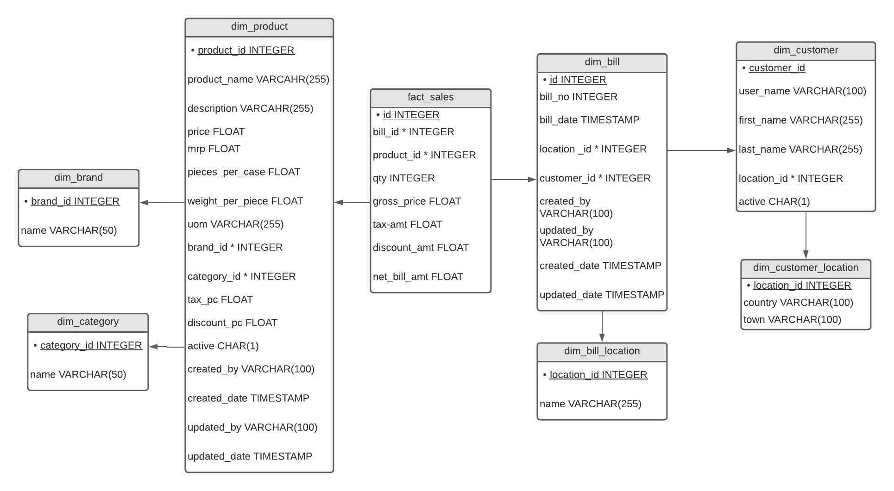

# Data Warehouse Design for an E-Commerce Site

## Business Requirement
We have a e-commerce site from the client and have to analyze data to improve their sales. These are the some basic business requiremnt of the client:
- The domain for th business is an e-commerce site.
- Analyze the data from the previous data that are:
 - selling fast
 - produce high profits 
 - low selling products

# Dimension and Fact table determination.
The following are the possible  fact and dimensions:
- **dim_brand** (*brand_id*, name)
- **dim_category** (*category_id*, name)
- **dim_customer_location** (*location_id*, country,town)
- **dim_bill_location** (*location_id*, name)
- **dim_customer** (*customer_id*, user_name, first_name, last_name, location_id*, active)
- **dim_bill** (*bill_id*, bill_no, bill_date, location_id, customer_id*, created_by, updated_by, created_date, updated_date)
- **fact_sales** (*sales_id*, bill_id*, product_id*, qty, gross_price, tax_amt, discount_amt, net_bill_amt)
- **dim_product** (*product_id*, product_name, description, price, mrp, pieces_per_case, weight_per_piece, uom, brand_id, category_id*, tax_pc, discount_pc, active, created_by, created_date, updated_by, updated_date)

Here, we have listed only one fact table as fact_sales and other remaining tables are the dimesnion table of our requirement.

## Physical Implementation of fact and dimension tables.
In this section, we list out the possible domain and datatypes for each possible fileds in the database. The figure below depicts our data warehouse implementation in detail.

# Process of ETL 
After the design of physical implementation of fact and dimension tabls, we are following these steps for the extract the data for raw db and perform some kind of transformation as required and load into the fact and dimension table as required.
## Extract the raw data from different sources and load them.

As we have data into csv file in our local system, so it is easier to handle those data as required and load into the database. For storage of the raw data into database, we are creating three shcemas for the storage of raw data.
- Creation of customer raw table and load raw customer data
> /schema/raw/create_table_raw_customer.sql
~~~~ sql
CREATE TABLE customer_raw(
  customer_id VARCHAR(255),
  user_name VARCHAR(255),
  first_name VARCHAR(255),
  last_name VARCHAR(255),
  country VARCHAR(255),
  town VARCHAR(255),
  active VARCHAR(255)
);
~~~~
After creation of customer raw table, we are dumping raw data into customer table using SQL command:
~~~~ sql
INSERT INTO customer_raw VALUES(%s,%s,%s,%s,%s,%s,%s);
~~~~
- Creation of product raw table and load raw product data
> /schema/raw/create_table_raw_product.sql
~~~~ sql
CREATE TABLE product_raw(
  product_id VARCHAR(255) ,
  product_name VARCHAR(255),
  description VARCHAR(255),
  price VARCHAR(255),
  mrp VARCHAR(255),
  pieces_per_case VARCHAR(255),
  weight_per_piece VARCHAR(255),
  uom VARCHAR(255),
  brand VARCHAR(255),
  category VARCHAR(255),
  tax_percent VARCHAR(255),
  active VARCHAR(255),
  created_by VARCHAR(255),
  created_date VARCHAR(255),
  updated_by VARCHAR(255),
  updated_date VARCHAR(255)
);
~~~~
After creation of product raw table, we are dumping raw data into product table using SQL command:
~~~~ sql
INSERT INTO product_raw VALUES(%s,%s,%s,%s,%s,%s,%s,%s,%s,%s,%s,%s,%s,%s,%s,%s);
~~~~
- Creation of sales raw table and load raw sales data.
> /schema/raw/create_table_raw_sales.sql
~~~~ sql
CREATE TABLE sales_raw(
  id VARCHAR(255),
  transaction_id VARCHAR(255),
  bill_no VARCHAR(255),
  bill_date VARCHAR(255),
  bill_location VARCHAR(255),
  customer_id VARCHAR(255),
  product_id VARCHAR(255),
  qty VARCHAR(255),
  uom VARCHAR(255),
  price VARCHAR(255),
  gross_price VARCHAR(255),
  tax_pc VARCHAR(255),
  tax_amount VARCHAR(255),
  discount_pc VARCHAR(255),
  discount_amt VARCHAR(255),
  net_bill_amt VARCHAR(255),
  created_by VARCHAR(255),
  updated_by VARCHAR(255),
  created_date VARCHAR(255),
  updated_date VARCHAR(255)
);
~~~~
After creation of product raw table, we are dumping raw data into product table using SQL command:
~~~~ sql
INSERT INTO sales_raw VALUES(%s,%s,%s,%s,%s,%s,%s,%s,%s,%s,%s,%s,%s,%s,%s,%s,%s,%s,%s,%s);
~~~~

Here, we have only used the VARCHAR datatype as this is all raw data and that may contain anything that we may not need. There might be some kind of formatting issues and missiong values and we have to deal with them what to do with them before loading them into fact and dimension tables.

## Creation of Fact and dim table for stroring the transformed data into warehouse.
We have discusse in detail about the datatypes used in the defination of fact and dim tables. By refering the physical implemenattaion of the e-commerce site we are using these fact and dimension table.
- Creation of dim_brand table 

~~~~ sql
CREATE TABLE dim_brand(
  brand_id SMALLSERIAL,
  name VARCHAR(50) NOT NULL,
  ONSTRAINT pk_brand_id PRIMARY KEY(brand_id)
);
~~~~ 

- Creation of dim_category table 
~~~~ sql
CREATE TABLE dim_category(
  category_id SMALLSERIAL,
  name VARCHAR(50) NOT NULL,
  CONSTRAINT pk_category_id PRIMARY KEY(category_id)
);
~~~~

- Creation of dim_bill_location table 

~~~~ sql
CREATE TABLE dim_bill_location(
  location_id SMALLSERIAL ,
  name VARCHAR(50) NOT NULL,
  CONSTRAINT pk_location_id PRIMARY KEY(location_id)
);
~~~~ 

- Creation of dim_customer_location table 

~~~~ sql
CREATE TABLE dim_customer_location(
  location_id SMALLSERIAL,
  country VARCHAR(100) NOT NULL,
  town VARCHAR(100) NOY NULL,
  CONSTRAINT pk_cust_location_id PRIMARY KEY(location_id)
)
~~~~ 

- Creation of dim_customer table 

~~~~ sql
CREATE TABLE dim_customer(
  customer_id SERIAL,
  user_name VARCHAR(100) NOT NULL,
  first_name VARCHAR(255) NOT NULL,
  last_name VARCHAR(255) NOT NULL,
  location_id INTEGER NOT NULL,
  active CHAR(1) NOT NULL,
  CONSTRAINT pk_customer_id PRIMARY KEY(customer_id),
  CONSTRAINT fk_location_id FOREIGN KEY(location_id) REFERENCES dim_customer_location(location_id)
);
~~~~ 

- Creation of dim_bill table 

~~~~ sql
CREATE TABLE dim_bill(
  id SERIAL,
  bill_no INTEGER NOT NULL,
  bill_date TIMESTAMP NOT NULL,
  location_id INTEGER NOT NULL,
  customer_id INTEGER NOT NULL,
  created_by VARCHAR(255) NOT NULL,
  updated_by VARCHAR(255),
  created_date TIMESTAMP NOT NULL,
  updated_date TIMESTAMP,
  CONSTRAINT pk_id PRIMARY KEY(id),
  CONSTRAINT fk_location_id1 FOREIGN KEY(location_id) REFERENCES dim_bill_location(location_id),
  CONSTRAINT fk_customer_id FOREIGN KEY(customer_id) REFERENCES dim_customer(customer_id)
);
);
~~~~ 

- Creation of dim_product table 

~~~~ sql
CREATE TABLE dim_product(
  product_id SERIAL,
  product_name VARCHAR(255) NOT NULL,
  description VARCHAR(255) NOT NULL,
  price FLOAT NOT NULL,
  mrp FLOAT NOT NULL,
  pieces_per_case FLOAT NOT NULL,
  uom VARCHAR(255) NOT NULL,
  brand_id INTEGER NOT NULL,
  category_id INTEGER NOT NULL,
  tax_pc FLOAT NOT NULL,
  discount_pc FLOAT NOT NULL,
  active CHAR(1) NOT NULL,
  created_by VARCHAR(255) NOT NULL,
  created_date TIMESTAMP NOT NULL,
  updated_by VARCHAR(255),
  updated_date TIMESTAMP,
  CONSTRAINT pk_product_id PRIMARY KEY(product_id),
  CONSTRAINT fk_brand_id FOREIGN KEY(brand_id) REFERENCES dim_brand(brand_id),
  CONSTRAINT fk_category_id FOREIGN KEY(category_id) REFERENCES dim_category(category_id)
);
~~~~ 

- Creation of fact_sales table 

~~~~ sql
CREATE TABLE fact_sales(
  id SERIAL,
  bill_id INTEGER NOT NULL,
  product_id INTEGER NOT NULL,
  qty SMALLINT NOT NULL,
  gross_price FLOAT,
  tax_amt FLOAT,
  discount_amt FLOAT,
  net_bill_amt FLOAT,
  CONSTRAINT pk_fact_sales_id PRIMARY KEY(id),
  CONSTRAINT fk_bill_id FOREIGN KEY(bill_id) REFERENCES dim_bill(id),
  CONSTRAINT fk_product_id FOREIGN KEY(product_id) REFERENCES dim_product(product_id)
)
~~~~ 

## Data population process into dimension and fact tables.

- insert into dim_brand table
~~~~ sql
INSERT INTO dim_brand(name)
SELECT 
  DISTINCT brand
FROM product_raw;
~~~~

- insert into dim_category table 
~~~~ sql
INSERT INTO dim_category(name)
SELECT  
  DISTINCT category
FROM product_raw;
~~~~

- insert into dim_bill_location
~~~~ sql
INSERT INTO dim_bill_location(name)
SELECT  
  DISTINCT bill_location
FROM sales_raw;
~~~~

- insert into dim_customer_location
~~~~ sql
INSERT INTO dim_customer_location(country,town)
SELECT  
    DISTINCT country,town 
  FROM customer_raw;
~~~~

- insert into dim_customer table.
~~~~ sql
INSERT INTO dim_customer(user_name,first_name,last_name,location_id,active)
SELECT 
  user_name,
  first_name,
  last_name,
  location_id,
  active
FROM customer_raw c
JOIN dim_customer_location d 
ON c.country = d.country 
  AND c.town = d.town;
~~~~

- insert into dim_bill table.
~~~~ sql
INSERT INTO dim_bill (
  bill_no, bill_date, location_id, customer_id, created_by, updated_by, created_date, updated_date
)
SELECT 
  CAST(bill_no AS INT),
  CASE 
    WHEN SPLIT_PART(bill_date, ' ', 1) = '2017-02-30'
      THEN '2017-02-28'
    ELSE
      CAST(SPLIT_PART(bill_date, ' ', 1) AS DATE)
  END,
  location_id,
  CAST (customer_id AS INT),
  INITCAP(created_by),
  CASE 
    WHEN updated_by IS NULL
      THEN created_by
    ELSE 
	  INITCAP(updated_by)
  END,
  CASE 
    WHEN SPLIT_PART(created_date, ' ', 1) = '2017-02-30'
      THEN '2017-02-28'
    ELSE
      CAST(SPLIT_PART(created_date, ' ', 1) AS DATE)
    END,
  CASE WHEN SPLIT_PART(created_date, ' ', 1) = '2017-02-30'
    THEN '2017-02-28'
  ELSE
    CAST(SPLIT_PART(created_date, ' ', 1) AS DATE)
  END
FROM sales_raw sr
JOIN dim_bill_location dbl
ON dbl.name = sr.bill_location;
~~~~

- insert into dim_product table.
~~~~ sql
INSERT INTO dim_product (
  product_name, description, price, mrp, pieces_per_case, uom, brand_id, category_id, tax_pc, discount_pc, active, created_by, created_date, updated_by, updated_date
)

SELECT 
  product_name,
  description,
  CAST (pr.price AS FLOAT),
  CAST (mrp AS FLOAT),
  CAST (pieces_per_case AS FLOAT),
  pr.uom,
  db.brand_id,
  category_id,
  CAST (tax_percent AS FLOAT),
  CAST(discount_pc AS FLOAT),
  active,
  pr.created_by,
  DATE(pr.created_date),
  pr.updated_by,
DATE(pr.updated_date)
FROM product_raw pr
JOIN dim_brand db
ON db.name = pr.brand
JOIN dim_category dc
ON dc.name = pr.category
JOIN sales_raw sr
ON sr.product_id = pr.product_id;
~~~~

- insert into fact_sales table.
~~~~ sql
INSERT INTO fact_sales (
    bill_id, product_id, qty, gross_price, tax_amt, discount_amt, net_bill_amt
)
SELECT 
  db.id,
  dp.product_id,
  CAST(qty as SMALLINT),
  CAST(gross_price AS FLOAT),
  CAST(tax_amount AS FLOAT),
  CAST(discount_amt AS FLOAT),
  CAST(net_bill_amt AS FLOAT)
FROM sales_raw sr
JOIN dim_bill db
  ON db.id =CAST(sr.bill_no AS INT)
JOIN dim_product dp
  ON dp.product_id = CAST(sr.product_id AS INT);  
~~~~

## Analyzing the populated data in fact and dimension tables
- Creating a view for seeing the total sales of any product and its billing amount related to it.
~~~~ sql
CREATE  OR REPLACE VIEW vw_sales_product AS
SELECT 
	p.product_id,
	p.product_name,
	p.description,
	SUM(net_bill_amt) as total_sales,
	AVG(net_bill_amt) as avg_price,
	SUM(qty) as total_quantity
FROM 
fact_sales s
JOIN dim_product p
	ON s.product_id = p.product_id
GROUP BY p.product_id,p.product_name;
~~~~

- Creating a view for retrieving data accoring to category 

~~~~ sql
CREATE OR REPLACE VIEW vw_sales_by_category AS
SELECT 
	c.name,
	SUM(net_bill_amt) as total_sales,
	AVG(net_bill_amt) as avg_price,
	SUM(qty) as total_quantity
FROM 
fact_sales s
JOIN dim_product p
	ON s.product_id = p.product_id
JOIN dim_category c
	ON p.category_id = c.category_id
GROUP BY c.name;
~~~~